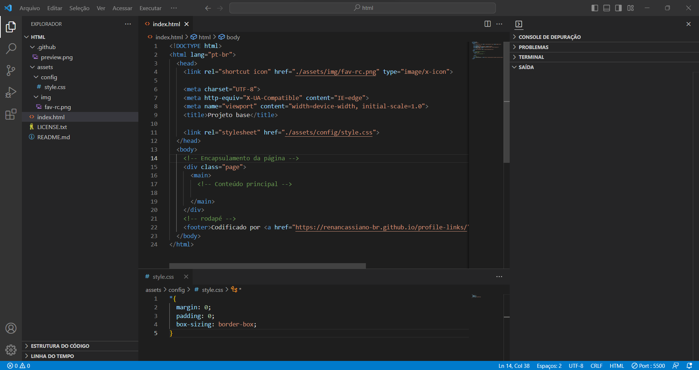

<h1 align="center">HTML | Projeto base</h1>

Página desenvolvida para servir de base para os projetos de front-end desenvolvidos por mim.

  <a href="#-tecnologias">Tecnologias</a>&nbsp;&nbsp;&nbsp;|&nbsp;&nbsp;&nbsp;
  <a href="#-projeto">Projeto</a>&nbsp;&nbsp;&nbsp;|&nbsp;&nbsp;&nbsp;
  <a href="#-layout">Layout</a>&nbsp;&nbsp;&nbsp;|&nbsp;&nbsp;&nbsp;
  <a href="#memo-licença">Licença</a>

  

 

  

## 🚀 Tecnologias

Esse projeto foi desenvolvido com as seguintes tecnologias:

- HTML e CSS
- Git e Github
- Markdown

## 💻 Projeto

O Projeto Base HTML é uma página web para servir de base para os próximos projetos de front-end feitos para cursos, testes entre outros.

⚠️Alguns links desse arquivo, são apenas de referência, ou seja, podem não funcionar. Obrigado pela compreensão.

🔗 - [Visite o projeto](https://renancassiano-br.github.io/base-html/)

## 🔖 Layout

Você pode visualizar o layout do projeto através [DESSE LINK](https://figma.com/duplicate). É necessário ter conta no [Figma](https://figma.com) para acessá-lo.

## :memo: Licença

Esse projeto está sob a [licença MIT](https://github.com/remy/mit-license).

---

Feito com ♥ by Rocketseat :wave: [Participe da nossa comunidade!](https://discord.gg/rocketseat)
